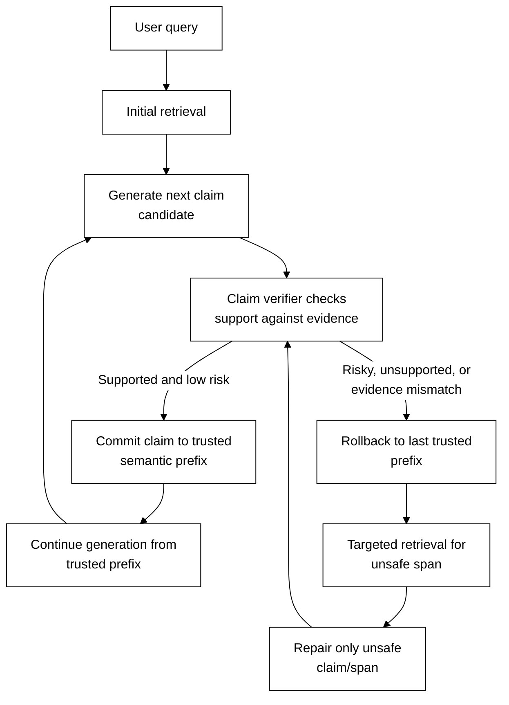
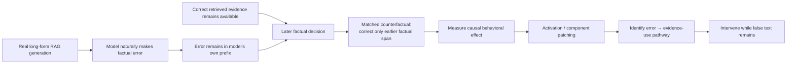

# Diagrams

## RiskRoll-RAG: verify before commit

```mermaid
---
config:
  theme: base
  themeVariables:
    background: '#ffffff'
    primaryColor: '#ffffff'
    primaryTextColor: '#000000'
    primaryBorderColor: '#000000'
    lineColor: '#000000'
    fontFamily: Times New Roman
    fontSize: 16px
  layout: dagre
---
flowchart TB
    A["User query"] --> B["Initial retrieval"]
    B --> C["Generate next claim<br>candidate"]
    C --> D["Claim verifier checks<br>support against evidence"]
    D -- Supported and low risk --> E["Commit claim to trusted<br>semantic prefix"]
    E --> F["Continue generation from<br>trusted prefix"]
    F --> C
    D -- "Risky, unsupported, or<br>evidence mismatch" --> G["Rollback to last trusted<br>prefix"]
    G --> H["Targeted retrieval for<br>unsafe span"]
    H --> I["Repair only unsafe<br>claim/span"]
    I --> D

    style A stroke:#000000,stroke-width:1px
    style B stroke:#000000,stroke-width:1px
    style C stroke:#000000,stroke-width:1px
    style D stroke:#000000,stroke-width:1px
    style E stroke:#000000,stroke-width:1px
    style F stroke:#000000,stroke-width:1px
    style G stroke:#000000,stroke-width:1px
    style H stroke:#000000,stroke-width:1px
    style I stroke:#000000,stroke-width:1px
```

## Current causal-interpretability direction

```mermaid
flowchart LR
    A["Real long-form RAG generation"] --> B["Model naturally makes factual error"]
    B --> C["Error remains in model's own prefix"]
    R["Correct retrieved evidence remains available"] --> D["Later factual decision"]
    C --> D
    D --> E["Matched counterfactual:<br>correct only earlier factual span"]
    E --> F["Measure causal behavioral effect"]
    F --> G["Activation / component patching"]
    G --> H["Identify error → evidence-use pathway"]
    H --> I["Intervene while false text remains"]
```
